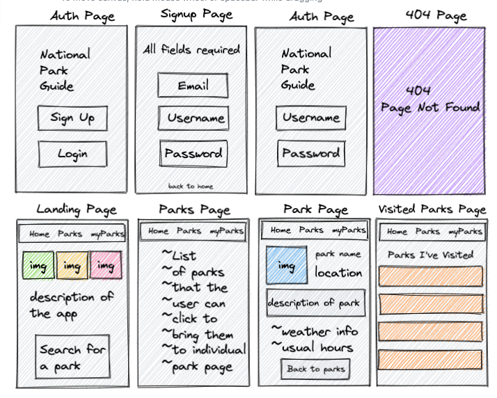
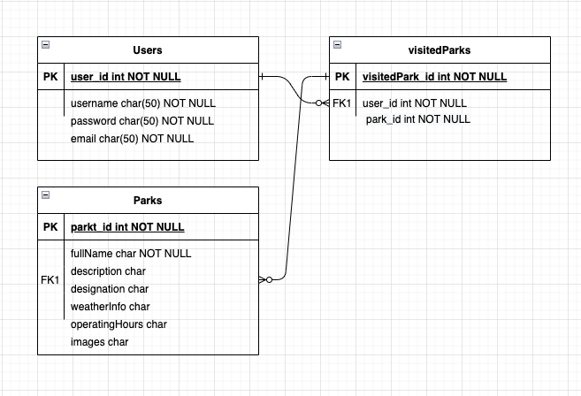

**USER STORY**
myParks is an open sourceapp that lets users search for and view national park data, as well as catalogue all the parks they've visited in their lifetime.

in order to use or contribute to the code of myParks, please fork and clone this repository, then install all dependencies by running `npm install`.
you'll then need to set up your database, i recommend using the same name as the one contained in this repo's config.json. the command for this is `db:create myparks_dev`. run `sequelize db:migrate`, and then start the server with `node server.js`. you're ready to work!

stretch goals to include photo posts to their visited park memories as well as social functionality.

